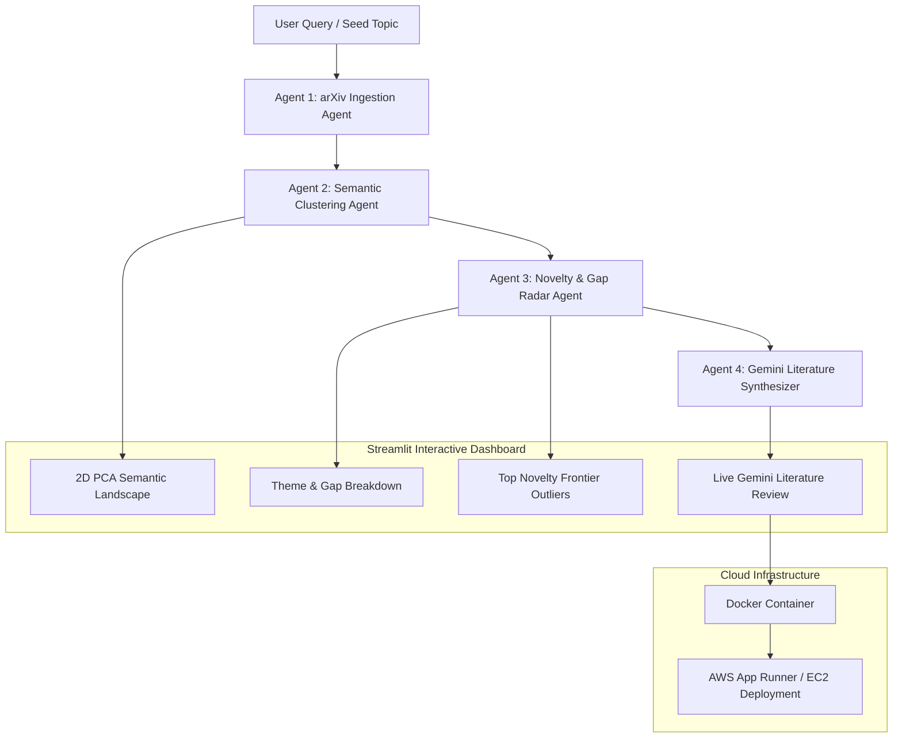

# 🔬 AI Agentic Workflows for Research: Literature Radar & Synthesis

[](https://www.python.org/)
[](https://streamlit.io/)
[](https://ai.google.dev/)
[](https://www.docker.com/)
[](https://aws.amazon.com/)
[](https://opensource.org/licenses/MIT)

---

## 📌 Executive Summary

Navigating vast scientific domains requires synthesizing hundreds of papers, identifying thematic consensus, and uncovering under-explored research white spaces. 

This project implements an autonomous **Multi-Agent Research Intelligence System** that:
1. **Agent 1 (Ingestion):** Ingests live scientific publications directly from the **arXiv API** (or curated offline domain datasets).
2. **Agent 2 (Clustering):** Performs **unsupervised semantic clustering** with dynamic Silhouette score optimization to automatically discover latent research themes.
3. **Agent 3 (Novelty Radar):** Quantifies **paper novelty scores** ($1 - \max(\text{similarity})$) and flags dense ("crowded") vs. sparse ("frontier") thematic areas.
4. **Visual Landscape:** Projects research papers onto an interactive **2D PCA Semantic Landscape** scaled by novelty.
5. **Agent 4 (Synthesis):** Employs **Google Gemini (Gemini 1.5 Flash)** to synthesize a publication-grade Literature Review report complete with identified white spaces and future research directions.

---

## 🏗️ Multi-Agent Architecture



---

## 🤖 The Multi-Agent Pipeline

* **Agent 1: Ingestion Agent (`src/arxiv_agent.py`)**  
  Queries the Open Access arXiv API to retrieve real-world papers with titles, abstracts, authors, publication dates, and PDF links. Includes automatic fallback to curated datasets during network timeouts.
* **Agent 2: Semantic Clustering Agent (`research_gap.py`)**  
  Transforms abstracts into TF-IDF representations and evaluates candidate cluster numbers ($k \in [2, 10]$), selecting the optimal $k$ by maximizing the **Silhouette Score**.
* **Agent 3: Novelty & Gap Radar Agent (`research_gap.py`)**  
  Computes pairwise Cosine distances across the entire corpus. Calculates a normalized novelty score for each paper, flags redundant duplicates, and surfaces high-novelty outliers.
* **Agent 4: Literature Synthesis Agent (`src/synthesis_agent.py`)**  
  Feeds the algorithmic cluster breakdown, representative anchor papers, and detected white spaces into **Google Gemini (Gemini 1.5 Flash)** to draft a structured 5-section literature review survey.

---

## 📂 Project Structure

```text
├── src/
│   ├── __init__.py               # Package initializer
│   ├── arxiv_agent.py            # Agent 1: Real-world arXiv literature ingestion
│   └── synthesis_agent.py        # Agent 4: Google Gemini literature synthesis
├── dataset/
│   └── sample_gut_heart_papers.csv # 15 Curated real-world test papers
├── app.py                        # Interactive Streamlit dashboard & landscape visualizer
├── research_gap.py               # Algorithmic clustering, novelty & gap engine
├── requirements.txt              # Core dependencies
├── Dockerfile                    # Container configuration for AWS / cloud
├── .dockerignore                 # Excludes caches and environment secrets
├── .gitignore                    # Prevents .env and secrets from being committed
├── .env.example                  # Environment variable template
└── README.md                     # Comprehensive project documentation
```

---

## 🚀 Quick Start (Local)

### 1. Clone & Navigate
```bash
git clone https://github.com/SHIVESH89/ai-agentic-research-workflow.git
cd ai-agentic-research-workflow
```

### 2. Set Up Virtual Environment
```bash
python -m venv venv
# On Windows:
venv\Scripts\activate
# On Linux/macOS:
source venv/bin/activate

pip install -r requirements.txt
```

### 3. Configure Gemini API Key
Create a `.env` file in the root directory:
```bash
cp .env.example .env
```
Add your free key from [Google AI Studio](https://aistudio.google.com/app/apikey):
```env
GEMINI_API_KEY=AIzaSyYourActualKeyHere
```
*(Your `.env` file is protected by `.gitignore` and will never be committed to Git).*

### 4. Run the Application
```bash
streamlit run app.py
```
Open `http://localhost:8501` in your browser.

---

## 🐳 Docker Containerization

To run the containerized application locally:

```bash
docker build -t research-agent .
docker run -p 8501:8501 -e GEMINI_API_KEY="your_actual_key" research-agent
```

---

## ☁️ Deployment on AWS

### Option 1: AWS App Runner (Serverless — Recommended for MITACS)
1. Push this repository to GitHub.
2. In the **AWS Console**, navigate to **AWS App Runner** and click **Create service**.
3. Choose **Source code repository** and link your GitHub repository.
4. Configure Build:
   - **Runtime:** Python 3
   - **Build command:** `pip install -r requirements.txt`
   - **Start command:** `streamlit run app.py --server.port=8080 --server.address=0.0.0.0`
   - **Port:** `8080`
5. Under **Environment variables**, securely add:
   - **Key:** `GEMINI_API_KEY`
   - **Value:** `your_gemini_api_key_here`
6. Click **Create & Deploy**. AWS will provide a live HTTPS URL.

### Option 2: AWS EC2 (Free Tier)
1. Launch an Ubuntu 22.04 `t2.micro` or `t3.micro` EC2 instance.
2. Allow inbound traffic on port `8501` in your Security Group.
3. Connect via SSH and run:
   ```bash
   sudo apt update && sudo apt install -y python3-pip git
   git clone https://github.com/SHIVESH89/ai-agentic-research-workflow.git
   cd ai-agentic-research-workflow
   pip install -r requirements.txt
   export GEMINI_API_KEY="your_api_key"
   nohup streamlit run app.py --server.port=8501 --server.address=0.0.0.0 &
   ```
4. Open `http://<EC2-PUBLIC-IP>:8501`.

---

## 📊 Sample Research Queries
- `Gut microbiome cardiovascular disease`
- `Antimicrobial resistance livestock metagenomics`
- `Agentic AI workflow orchestration`
- `RNA therapeutics delivery mechanisms`
